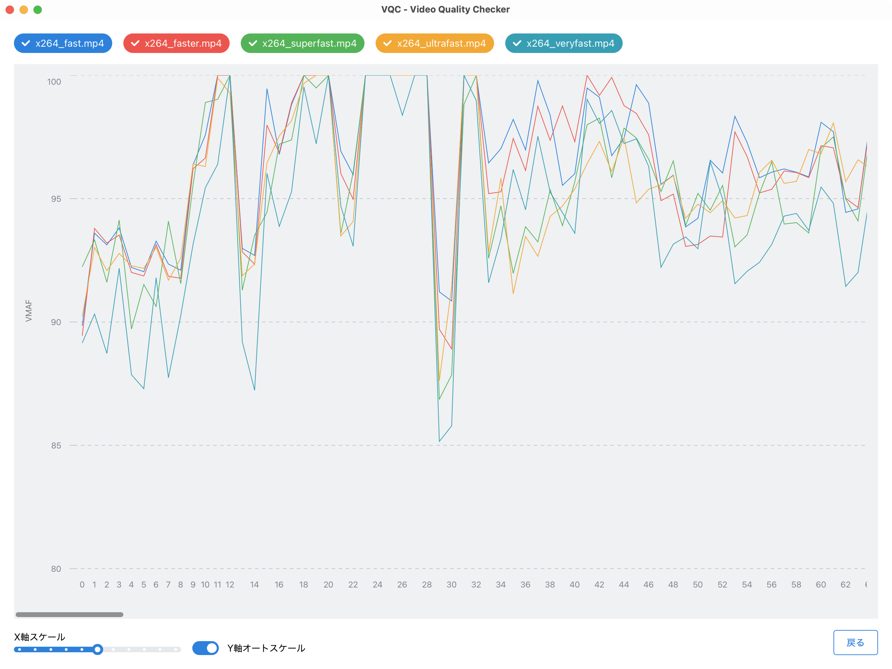

# VQC - Video Quality Checker

Visualyze [VMAF](https://github.com/Netflix/vmaf).
Download executables from [releases](https://github.com/terabayashik/vqc/releases).



# Prerequisites

## Download static FFmpeg binary

Run script below. These scripts let you put ffmpeg binary to `src-tauri/bin`.
> [!WARNING]
> Windows and Linux on Arm is not supported.

### macOS / Linux
```sh
bash scripts/download_ffmpeg.sh
```

### Windows
```powershell
pwsh scripts\Download-Ffmpeg.ps1
```

# Development
```sh
pnpm tauri:dev
```
